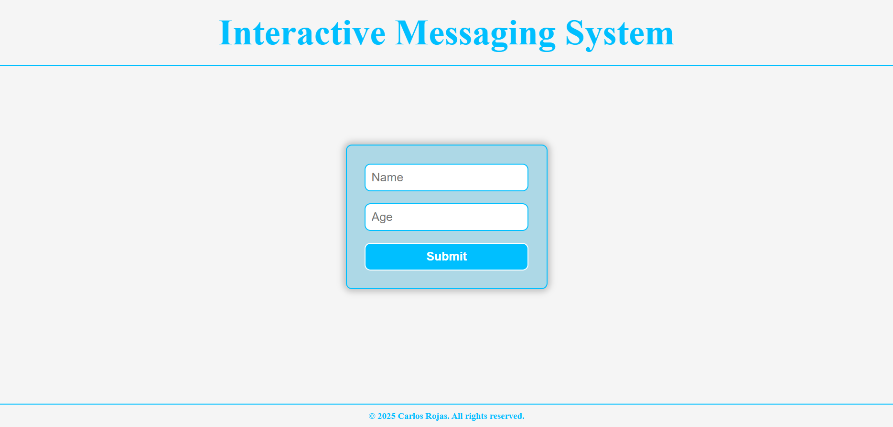

# Interactive Messaging System

A simple and fun web application that displays a personalized message and a dancing GIF based on the user's age. If the user is underage, a motivational message is shown; if the user is an adult, a welcome to tech opportunities is displayed.

## 🚀 Features

- Collects username and age through a clean form.
- Validates age input and shows a modern alert using SweetAlert2.
- Dynamically displays a message and a local dancing GIF.
- Responsive and friendly UI built with HTML, CSS, and vanilla JavaScript.

## 🖼️ Preview



## 🛠️ Technologies Used

- HTML5
- CSS3 (Flexbox & Grid)
- JavaScript (DOM manipulation)
- [SweetAlert2](https://sweetalert2.github.io/) for modern alerts

## 📁 Project Structure

```bash
project-root/
│
├── LICENSE
├── index.html
├── assets/
│   ├── css/
│   │   └── styles.css
│   ├── js/
│   │   └── main.js
│   └── img/
│       ├── guy.gif
│       ├── kakashi.gif
│       └── preview.png
```

- `index.html`: Main HTML structure.
- `assets/css/styles.css`: Custom styles.
- `assets/js/main.js`: Core JavaScript logic.
- `assets/img/`: Images and GIFs directory.

## ✅ How to Use

1. Clone the repository:
   ```bash
   git clone https://github.com/Carturo8/Interactive-Messaging-System
   ```

2. Open `index.html` in your browser.

3. Enter your name and age, and enjoy the personalized response!

## ⚠️ Notes

- Make sure your browser allows loading local image files if testing locally.

- GIFs should be placed in the assets/img/ folder as used in the script.

## 📄 License

This project is licensed under the MIT License – see the [LICENSE](https://github.com/Carturo8/Interactive-Messaging-System/blob/main/LICENSE) file for more details.
